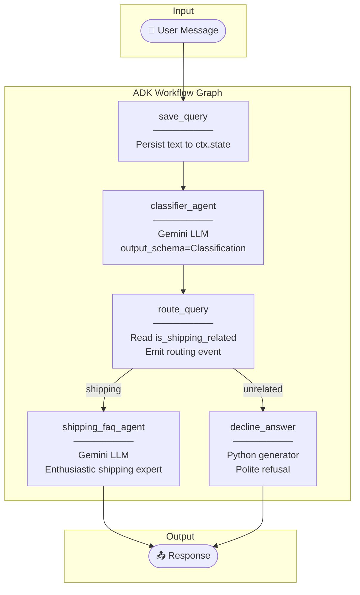
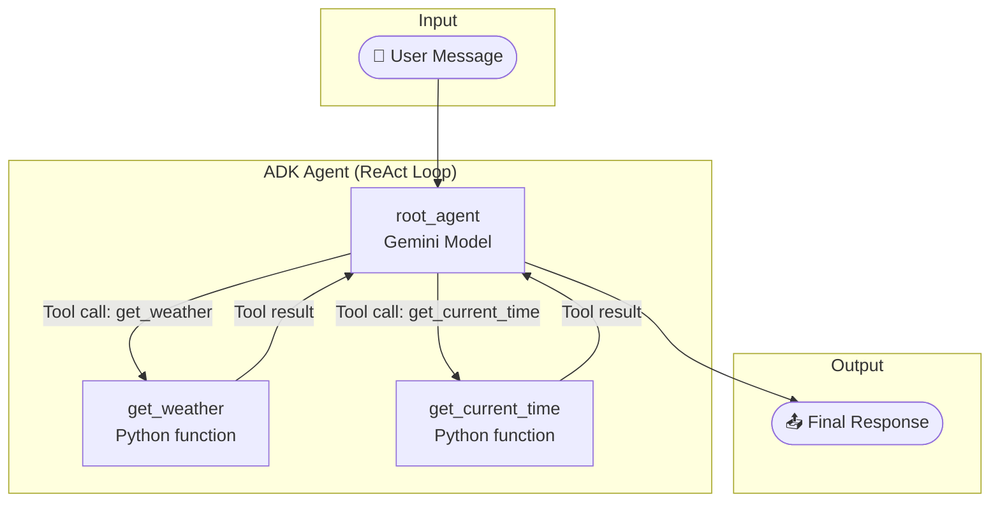

# Day 3: AI Agents — Architecture Design Document

This document provides a technical deep-dive into the two agent systems built on Day 3 of the 5-Day AI Agents Intensive Course with Google.

---

## 1. System Overview

Day 3 introduces two complementary ADK agent patterns:

| Project | Pattern | Key ADK Concepts |
|---------|---------|-----------------|
| **Customer Support Agent** | `Workflow` graph with `LlmAgent` nodes | Structured output, conditional routing, state persistence |
| **Weather Assistant** | Single `Agent` with tool definitions | Function calling, tool selection, dynamic execution |

Both projects use the **Google Agent Development Kit (ADK)**, served via a **FastAPI** application and accessible through the **ADK Dev UI**.

---

## 2. Project 1: Customer Support Routing Agent

### Full Architecture



### Workflow Node Details

#### Node 1: `save_query` (Python function)
- **Type**: Plain synchronous function → returns `Event`
- **Purpose**: Extract text from `types.Content` and persist to session state
- **State mutation**: `state_delta={"user_query": text}`
- **Why needed**: Downstream nodes need the original query text, which gets overwritten by the LLM classification output

```python
def save_query(ctx: Context, node_input: types.Content) -> Event:
    text = node_input.parts[0].text
    return Event(output=text, actions=EventActions(state_delta={"user_query": text}))
```

#### Node 2: `classifier_agent` (LlmAgent)
- **Type**: `LlmAgent` — ADK's built-in LLM wrapper node
- **Model**: `gemini-3.1-flash-lite` with retry logic
- **Output**: Forces structured JSON matching `Classification` Pydantic schema

```python
class Classification(BaseModel):
    is_shipping_related: bool = Field(
        description="True if the query is about shipping. False otherwise."
    )
```

#### Node 3: `route_query` (Python function)
- **Type**: Plain synchronous function — reads classification, emits route
- **Routing**: Returns `EventActions(route="shipping")` or `route="unrelated"`
- **Also passes**: The original query from `ctx.state` as `output` for downstream agents

#### Node 4a: `shipping_faq_agent` (LlmAgent)
- **Type**: `LlmAgent` with personality-heavy instruction prompt
- **Receives**: Original user query (from `route_query` output)
- **Responds**: With emojis, high energy, and highlights free shipping policy

#### Node 4b: `decline_answer` (async generator)
- **Type**: Python generator function (yields Events)
- **Purpose**: Generates a polite refusal for non-shipping queries
- **Pattern**: Yields a content event (shown to user) + output event (terminates workflow)

### State Management

```
ctx.state["user_query"]
    │
    Set by: save_query
    Read by: route_query
    Purpose: Preserve original text before LLM classification overwrites node output
```

---

## 3. Project 2: Weather Assistant (Tool Calling)

### Full Architecture



### How Tool Calling Works (ReAct Loop)

The agent follows a **Reasoning + Acting (ReAct)** loop internally:

```
1. User sends message
        │
        ▼
2. Gemini receives message + tool definitions (as function signatures)
        │
        ▼
3. Gemini decides: "Do I need a tool?"
        │
        ├─ YES → Generates a function_call response
        │           → ADK intercepts, executes the Python function
        │           → Result fed back to Gemini as function_response
        │           → Loop repeats from step 3
        │
        └─ NO  → Generates final text response → sent to user
```

### Tool Definitions

```python
def get_weather(query: str) -> str:
    """Simulates a web search for weather information.
    The docstring IS the tool description Gemini sees.
    """
    if "sf" in query.lower() or "san francisco" in query.lower():
        return "It's 60 degrees and foggy."
    return "It's 90 degrees and sunny."


def get_current_time(query: str) -> str:
    """Simulates getting the current time for a city.
    Uses Python's zoneinfo for real timezone resolution.
    """
    if "sf" in query.lower() or "san francisco" in query.lower():
        tz = ZoneInfo("America/Los_Angeles")
        now = datetime.datetime.now(tz)
        return f"The current time is {now.strftime('%Y-%m-%d %H:%M:%S %Z%z')}"
    return f"Sorry, I don't have timezone info for: {query}."
```

> **Key Insight**: The function's **docstring** and **type annotations** are automatically converted to a JSON schema that Gemini uses to decide when and how to call the tool. Write clear docstrings — they are part of the prompt!

### Agent Configuration

```python
root_agent = Agent(
    name="root_agent",
    model=Gemini(
        model="gemini-flash-latest",
        retry_options=types.HttpRetryOptions(attempts=3),
    ),
    instruction="You are a helpful AI assistant...",
    tools=[get_weather, get_current_time],  # Tools registered here
)
```

---

## 4. Comparison: Workflow vs. Agent

| Feature | Customer Support (Workflow) | Weather Assistant (Agent) |
|---------|---------------------------|--------------------------|
| **Control Flow** | Explicit graph edges, you define every transition | Internal ReAct loop, model decides what to do next |
| **Predictability** | High — you can trace every step | Medium — model chooses tool order dynamically |
| **Best For** | Multi-stage pipelines with clear business logic | Open-ended tasks requiring dynamic tool use |
| **Node Types** | Mix of LlmAgent + Python functions | Single Agent node + tool functions |
| **Routing** | Explicit RoutingMap dict | Implicit — model decides |
| **State** | Manually managed via `ctx.state` | Managed by ADK session service |

---

## 5. FastAPI & ADK Dev UI Integration

Both projects expose themselves via FastAPI using ADK's built-in integration:

```python
app: FastAPI = get_fast_api_app(
    agents_dir=AGENT_DIR,
    web=True,                       # Enables ADK Dev UI at /dev-ui/
    session_service_uri=None,       # In-memory sessions (no DB needed locally)
)
```

### Available Endpoints

| Endpoint | Method | Description |
|----------|--------|-------------|
| `/dev-ui/` | GET | Browser-based chat UI for testing |
| `/run_sse` | POST | Stream agent responses via Server-Sent Events |
| `/apps/{app}/users/{user}/sessions` | POST | Create a new session |
| `/feedback` | POST | Log user feedback |

---

## 6. Environment Configuration

Both agents support **Google AI Studio** (API key) and **Vertex AI** (GCP auth):

```
GEMINI_API_KEY set?
       │
       ├─ YES → Use AI Studio (GOOGLE_GENAI_USE_VERTEXAI=False)
       │
       └─ NO  → Try google.auth.default() for Vertex AI
                     │
                     └─ Fails → Fall back to AI Studio mode
```

---

*Architecture authored for the [5-Day AI Agents Intensive Vibe Coding Course with Google](https://github.com/Shivammakwana1997/5-Day-AI-Agents-Intensive-Vibe-Coding-Course-With-Google)*
