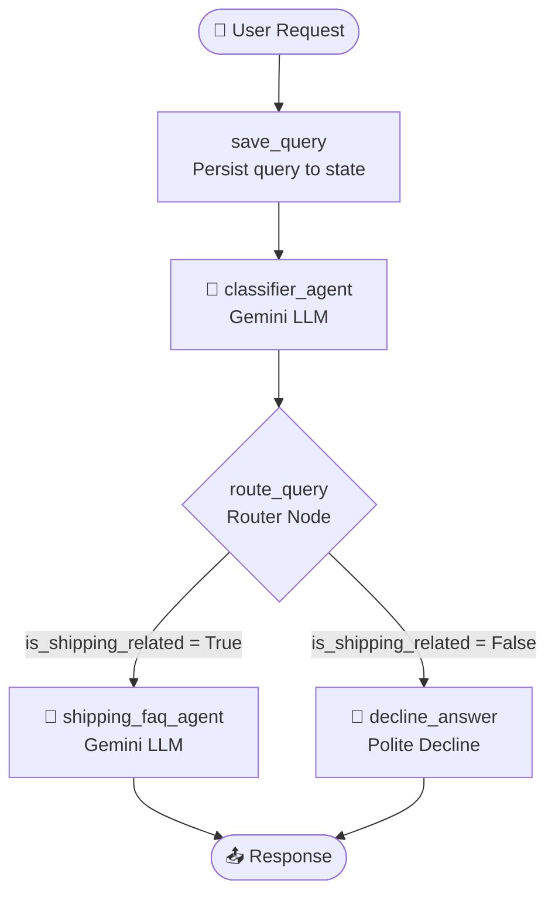
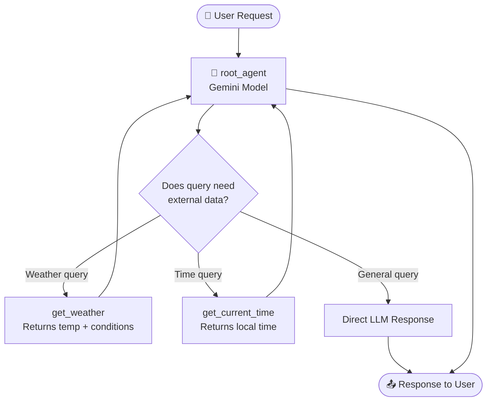

# 🤖 Day 3: AI Agents — Routing Workflows & Tool Calling

> **5-Day AI Agents Intensive with Google** — Day 3: Building intelligent multi-agent systems with conditional routing and dynamic function calling using the **Google Agent Development Kit (ADK)**.

---

## 🌟 What You'll Learn (Day 3 Concepts)

| Concept | What It Means |
|---------|---------------|
| **ADK Workflow Graphs** | Stateful, directed graph-based orchestration with conditional routing |
| **LlmAgent** | A pre-built ADK node that wraps a Gemini model call with structured instructions |
| **Conditional Routing** | Dynamically routing workflow execution based on LLM classification output |
| **Pydantic Structured Output** | Forcing LLM responses into typed schemas using `output_schema` |
| **Function / Tool Calling** | Letting an agent decide at runtime which Python function to invoke |

---

## 📁 Project Structure

```
Day3/
├── customer-support-agent/        # Project 1: Routing Workflow
│   ├── app/
│   │   ├── agent.py               # ⭐ Multi-stage workflow + routing logic
│   │   ├── fast_api_app.py        # FastAPI server wrapping ADK
│   │   └── app_utils/             # Utilities (telemetry, typing, services)
│   ├── tests/                     # Unit & integration tests
│   ├── Dockerfile                 # Production container
│   ├── pyproject.toml             # Dependencies (managed with uv)
│   └── .env.example               # Environment variable template
│
└── weather-assistant/             # Project 2: Tool Calling
    ├── app/
    │   ├── agent.py               # ⭐ Agent with get_weather + get_current_time tools
    │   ├── fast_api_app.py
    │   └── app_utils/
    ├── tests/
    ├── Dockerfile
    ├── pyproject.toml
    └── .env.example
```

---

## 🏗️ Project 1: Customer Support Routing Agent

An intelligent customer support system that **classifies queries and routes them** to specialized handlers — all within a single ADK Workflow graph.

### Architecture



### How It Works

1. **`save_query`** — Saves the raw user query to `ctx.state` for downstream access
2. **`classifier_agent`** — LLM agent classifies the query into a `Classification` Pydantic schema:
   ```python
   class Classification(BaseModel):
       is_shipping_related: bool
   ```
3. **`route_query`** — Reads the classification and emits a routing event (`"shipping"` or `"unrelated"`)
4. **`shipping_faq_agent`** — Enthusiastic shipping assistant with emoji responses 🎉
5. **`decline_answer`** — Politely declines non-shipping queries

### Key ADK Patterns Used
```python
# Conditional routing with a RoutingMap (dict)
(route_query, {
    "shipping":  shipping_faq_agent,
    "unrelated": decline_answer,
})

# Structured LLM output with Pydantic
classifier_agent = LlmAgent(
    model=Gemini("gemini-3.1-flash-lite"),
    output_schema=Classification,   # Forces structured JSON output
)
```

---

## 🌦️ Project 2: Weather Assistant (Tool Calling)

Demonstrates **function calling** — the agent dynamically decides which Python tool to call based on the user's query, without pre-programming every possible path.

### Architecture



### Tools Defined

```python
def get_weather(query: str) -> str:
    """Simulates looking up current weather conditions for a location."""
    if "sf" in query.lower() or "san francisco" in query.lower():
        return "It's 60 degrees and foggy."
    return "It's 90 degrees and sunny."


def get_current_time(query: str) -> str:
    """Returns the real current time for a given city using Python's zoneinfo."""
    if "sf" in query.lower() or "san francisco" in query.lower():
        tz = ZoneInfo("America/Los_Angeles")
        now = datetime.datetime.now(tz)
        return f"The current time is {now.strftime('%Y-%m-%d %H:%M:%S %Z%z')}"

# Agent automatically decides which tool(s) to call
root_agent = Agent(
    model=Gemini("gemini-flash-latest"),
    tools=[get_weather, get_current_time],
)
```

---

## ⚡ Quick Start

### Prerequisites

| Tool | Install |
|------|---------|
| **Python 3.11+** | [python.org](https://python.org) |
| **uv** | `pip install uv` |
| **Gemini API Key** | [aistudio.google.com](https://aistudio.google.com) |

### Run the Customer Support Agent

```bash
cd Day3/customer-support-agent

# Set up environment
cp .env.example .env
# Edit .env → paste your GEMINI_API_KEY

# Install dependencies
uv sync

# Launch ADK Dev UI
uv run adk web
```

Open [http://127.0.0.1:8000](http://127.0.0.1:8000) → select `app`.

### Run the Weather Assistant

```bash
cd Day3/weather-assistant

cp .env.example .env
# Edit .env → paste your GEMINI_API_KEY

uv sync
uv run adk web
```

---

## 🧪 Test Queries

### Customer Support Agent
| Query | Expected Route |
|-------|---------------|
| `"Where is my package?"` | → `shipping_faq_agent` 🚚 |
| `"What's the return policy?"` | → `shipping_faq_agent` 🚚 |
| `"What's the weather like?"` | → `decline_answer` 🚫 |
| `"Tell me a joke"` | → `decline_answer` 🚫 |

### Weather Assistant
| Query | Tool Called |
|-------|------------|
| `"What's the weather in San Francisco?"` | `get_weather` |
| `"What time is it in SF?"` | `get_current_time` |
| `"What is the capital of France?"` | *(no tool, direct LLM)* |

---

## 🛠️ Commands

| Command | Description |
|---------|-------------|
| `uv run adk web` | Launch ADK Dev UI at localhost:8000 |
| `uv run pytest tests/` | Run all tests |
| `uv run adk run app` | Run agent in CLI mode |

---

## 📚 Key Files to Study

| File | Why It Matters |
|------|---------------|
| [`customer-support-agent/app/agent.py`](./customer-support-agent/app/agent.py) | Full workflow with Pydantic output + conditional routing |
| [`weather-assistant/app/agent.py`](./weather-assistant/app/agent.py) | Tool definitions + Agent wiring |

---

*Built during the [5-Day AI Agents Intensive Vibe Coding Course with Google](https://github.com/Shivammakwana1997/5-Day-AI-Agents-Intensive-Vibe-Coding-Course-With-Google)*
