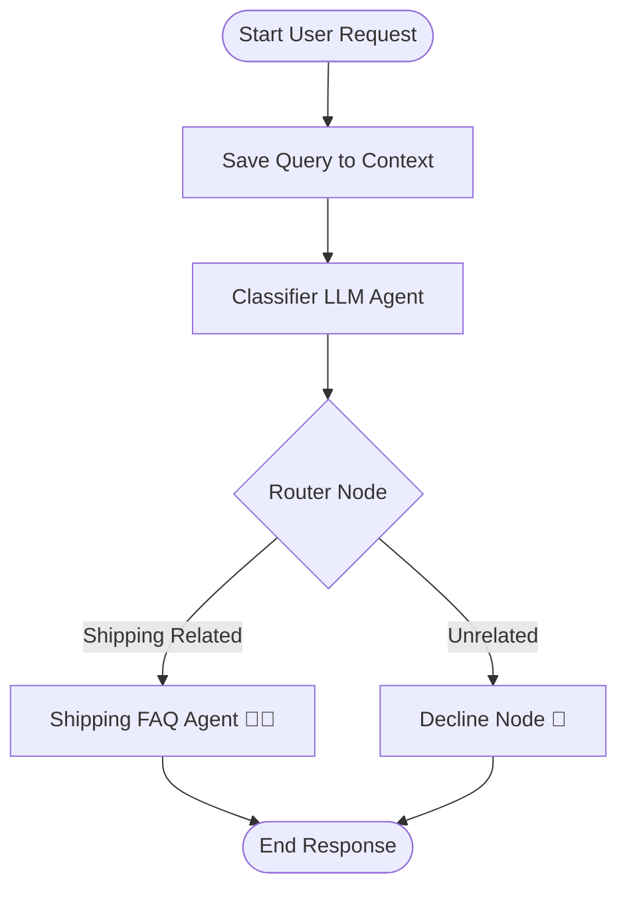
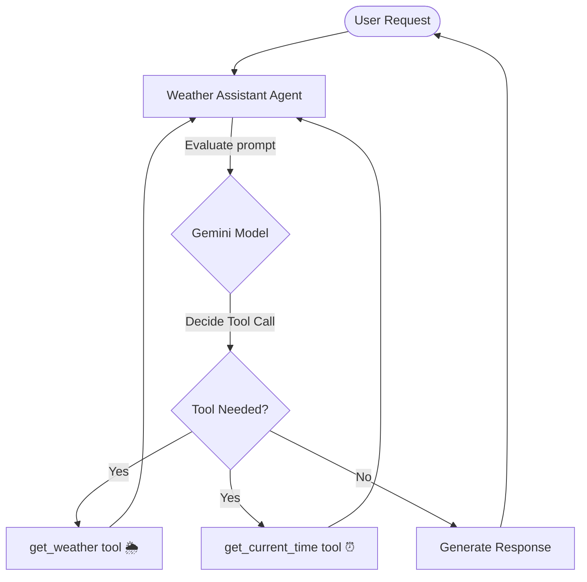

# Day 3: AI Agents - Routing Workflows & Tool Calling (Function Calling)

Welcome to Day 3 of the **5-Day AI Agents Intensive Vibe Coding Course with Google**! Today, we built two advanced agents using the Google Agent Development Kit (ADK): a conditional customer-support agent that routes user queries, and a weather-assistant agent capable of dynamically executing local Python tools based on user inputs.

---

## 🏗️ Architecture & Workflows

### 1. Customer Support Routing Agent
This agent uses a multi-stage **Workflow** diagram. When a request comes in:
1. **Save Query**: Persists the user's query into the workflow context.
2. **Classifier Agent**: An LLM agent (`gemini-3.1-flash-lite`) determines whether the request is shipping-related or unrelated, outputting a structured Pydantic schema.
3. **Router Node**: Evaluates the classification and dynamically routes the request to either the FAQ responder or the decline message.
4. **FAQ Agent**: If shipping-related, replies enthusiastically with emojis and highlights the free shipping policy.
5. **Decline Node**: If unrelated, politely declines to answer non-shipping topics.



---

### 2. Weather Assistant (Tool Calling)
This assistant demonstrates **Function Calling (Tool Use)**. Rather than relying solely on pre-trained weights, the agent evaluates the query, decides if it requires external data, and triggers the appropriate Python function:
- `get_weather(query)`: Simulates looking up current temperatures.
- `get_current_time(query)`: Resolves real-time timezones using standard Python modules.



---

## 📂 Day 3 Contents

- [customer-support-agent/](file:///a:/5-day%20online%20course/Day3/temp_clone/Day3/customer-support-agent/): Fully-configured ADK multi-agent workflow routing system.
- [weather-assistant/](file:///a:/5-day%20online%20course/Day3/temp_clone/Day3/weather-assistant/): ADK tool-calling agent executing local helper tools.
- [bad_schema.sql](file:///a:/5-day%20online%20course/Day3/temp_clone/Day3/bad_schema.sql): Sample SQL schema validating rules.
- [product_model.py](file:///a:/5-day%20online%20course/Day3/temp_clone/Day3/product_model.py) & [product.json](file:///a:/5-day%20online%20course/Day3/temp_clone/Day3/product.json): Pydantic model schemas and JSON validation examples.
- [my_script.py](file:///a:/5-day%20online%20course/Day3/temp_clone/Day3/my_script.py): General helper script.

---

## 🛠️ Getting Started

### Prerequisites
Make sure you have `uv` and `google-agents-cli` installed:
```bash
# Install UV package manager
powershell -c "irm https://astral.sh/uv/install.ps1 | iex"

# Install agents-cli toolchain
uv tool install google-agents-cli
```

### Running the Agents
1. Navigate to the agent's folder:
   ```bash
   cd customer-support-agent
   # or cd weather-assistant
   ```
2. Copy the environment file and set up your API Key:
   ```bash
   cp .env.example .env
   # Edit .env and paste your GEMINI_API_KEY
   ```
3. Install dependencies and start the playground UI:
   ```bash
   agents-cli install
   agents-cli playground
   ```
