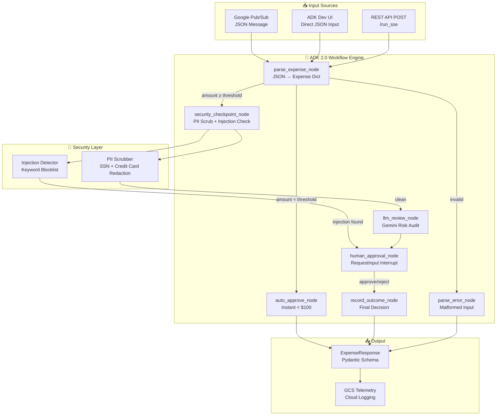

# Day 4: Ambient Expense Agent — Architecture Design Document

This document provides a comprehensive technical deep-dive into the **Ambient Expense Agent** built on Day 4 of the 5-Day AI Agents Intensive Course with Google.

---

## 1. System Overview

The **Ambient Expense Agent** is an asynchronous, event-driven auditing pipeline built with the **Google Agent Development Kit (ADK) 2.0 Workflow API**. It acts as an **ambient AI agent** — one that runs passively in the background, processing incoming expense events without requiring active user prompting.

### What "Ambient" Means

Unlike a conversational agent that waits for explicit user messages, an ambient agent:
- Is **triggered by external events** (e.g., a Pub/Sub message, a webhook call, or a form submission)
- **Runs autonomously** through a multi-step pipeline
- **Suspends and resumes** when human judgment is needed
- **Produces a structured output** (not a chat reply) that feeds downstream systems

---

## 2. Full System Architecture



---

## 3. Workflow Graph — Node-by-Node Breakdown

The agent is wired as an ADK 2.0 `Workflow` (a directed graph of async generator functions). Each node receives `Context` and yields `Event` objects that carry routing decisions, state mutations, and content.

### Node 1: `parse_expense_node`

**Purpose:** Parse the raw user/event input into a typed expense dictionary.

**Routing Logic:**
```
Input Text
    │
    ├─ Is it "approve"/"reject" during an active session?
    │      └─► route: "human_decision" → human_approval_node
    │
    ├─ Is it valid JSON with { data: {...} }?
    │      ├─ amount < THRESHOLD  → route: "auto_approve"
    │      ├─ amount ≥ THRESHOLD  → route: "security_check"
    │      └─ missing fields      → route: "error"
    │
    └─ Base64 Pub/Sub envelope?
           └─► Decoded and re-parsed
```

**Key Design Decision:** The node also acts as the re-entry point when the human types `approve`/`reject` in the Dev UI (since the Dev UI sends all messages as new turns). By detecting these keywords and checking `ctx.state["expense"]` exists, we correctly route the reply to the approval handler instead of failing.

---

### Node 2: `auto_approve_node`

**Purpose:** Instantly approve low-value expenses without LLM cost or human latency.

**Inputs:** `ctx.state["expense"]` (set by parse node)  
**Output:** `ExpenseResponse(status="Approved (Auto)", ...)`

---

### Node 3: `security_checkpoint_node`

**Purpose:** The pre-LLM security gate — the most critical safety layer.

```
Description Text
      │
      ├─ Prompt Injection Check (keyword matching)
      │       Patterns: "ignore all previous", "bypass threshold",
      │                 "force auto-approval", "override rules", ...
      │       ├─ DETECTED  → flag state, route: "security_alert"
      │       └─ CLEAN     → continue
      │
      └─ PII Scrubbing (regex)
              SSN:  \b\d{3}-\d{2}-\d{4}\b         → [REDACTED_SSN]
              CC:   \b\d{4}[-\s]?\d{4}[-\s]?...   → [REDACTED_CC]
              └─ route: "clean"
```

**Why PII scrubbing before LLM?**  
Even if a user accidentally (or intentionally) includes a credit card number in the description, it must never be sent to an external LLM API where it could be logged or learned.

---

### Node 4: `llm_review_node`

**Purpose:** Invoke Gemini to produce a structured risk assessment.

**System Prompt Pattern:**
```
You are an AI expense auditor. Audit the following expense details for risk factors
and potential policy violations (such as duplicate entries, off-hours dates,
suspicious categories, or overly vague descriptions). Provide a concise risk
assessment.

Amount: $500.0
Submitter: Alice
Category: Meals
Description: Client dinner
Date: 2026-07-06
```

**Model:** `gemini-3.1-flash-lite` (configured in `config.json`)  
**Error Handling:** If the LLM call fails, the risk report is set to the exception message and the workflow continues (does not crash).

---

### Node 5: `human_approval_node`

**Purpose:** Suspend the workflow and await a human decision.

**ADK Mechanism:** `RequestInput(interrupt_id="decision", message=...)` pauses execution and stores the suspension point in the session database. The workflow is resumed when the next turn arrives with the matching interrupt ID.

**Three ways a decision can arrive:**
1. **`ctx.resume_inputs["decision"]`** — proper ADK interrupt resume (A2A protocol)
2. **`ctx.state["pending_decision"]`** — typed "approve" reply routed through `parse_expense_node`
3. **Prompt message shown** — if neither of the above, shows the approval request

---

### Node 6: `record_outcome_node`

**Purpose:** Finalize and return the `ExpenseResponse`.

**Input:** Decision string (`"approve"` or anything else = `"Rejected"`)  
**Output:** Structured `ExpenseResponse` with full metadata.

---

## 4. Data Models

### `ExpenseResponse` — Workflow Output Schema

```python
class ExpenseResponse(BaseModel):
    status: str          # "Approved" | "Approved (Auto)" | "Rejected" | "Error"
    amount: float        # Sanitized expense amount (USD)
    submitter: str       # Name of the person who submitted the expense
    category: str        # Expense category (e.g., "Meals", "Travel")
    description: str     # Potentially PII-scrubbed description
    date: str            # Expense date (YYYY-MM-DD)
    risk_report: str     # LLM audit result or security alert message
```

### Workflow Graph Edges

```python
edges = [
    (START, parse_expense_node),
    (parse_expense_node, {
        "auto_approve":   auto_approve_node,
        "security_check": security_checkpoint_node,
        "error":          parse_error_node,
        "human_decision": human_approval_node,   # Re-entry for UI replies
    }),
    (security_checkpoint_node, {
        "clean":          llm_review_node,
        "security_alert": human_approval_node,
    }),
    (llm_review_node,       human_approval_node),
    (human_approval_node,   record_outcome_node),
]
```

---

## 5. Security Architecture

### Multi-Layer Defense Strategy

```
Expense Submission
        │
        ▼
┌───────────────────────────────────────────┐
│  Layer 1: Input Validation                │
│  • JSON schema check                      │
│  • Required field enforcement             │
│  • Amount type safety (float coercion)    │
└───────────────────┬───────────────────────┘
                    │
                    ▼
┌───────────────────────────────────────────┐
│  Layer 2: PII Redaction (Regex)           │
│  • SSN patterns: \d{3}-\d{2}-\d{4}       │
│  • CC patterns: 13–16 digit sequences     │
│  Replaced with [REDACTED_SSN/CC]          │
└───────────────────┬───────────────────────┘
                    │
                    ▼
┌───────────────────────────────────────────┐
│  Layer 3: Prompt Injection Detection      │
│  Blocked phrases:                         │
│  • "ignore all previous instructions"    │
│  • "bypass threshold / rules"            │
│  • "force auto-approval"                 │
│  • "override threshold / rules"          │
│  • "act as" / "developer mode"           │
│  → LLM bypassed, escalated to human      │
└───────────────────┬───────────────────────┘
                    │
                    ▼
┌───────────────────────────────────────────┐
│  Layer 4: LLM Audit                       │
│  Gemini analyzes:                         │
│  • Suspicious categories                  │
│  • Vague/duplicate descriptions           │
│  • Weekend / off-policy dates             │
└───────────────────┬───────────────────────┘
                    │
                    ▼
┌───────────────────────────────────────────┐
│  Layer 5: Human-in-the-Loop               │
│  Final authority for all flagged expenses │
└───────────────────────────────────────────┘
```

---

## 6. Telemetry & Observability

### OpenTelemetry Integration (`app_utils/telemetry.py`)

When `LOGS_BUCKET_NAME` is configured:
- Exports LLM completion traces to **Google Cloud Storage** in JSONL format
- Enforces `OTEL_INSTRUMENTATION_GENAI_CAPTURE_MESSAGE_CONTENT=NO_CONTENT`  
  → Only token counts and latency are logged, **never** raw prompts or responses
- Tags traces with `service.namespace=ambient-expense-agent` and `service.version={COMMIT_SHA}`

### Feedback Endpoint (`POST /feedback`)

The FastAPI layer exposes a `/feedback` endpoint accepting:
```python
class Feedback(BaseModel):
    score: int | float          # User satisfaction score
    text: str | None            # Optional free-text comment
    session_id: str             # Links feedback to a specific session
    user_id: str
```
Logs are shipped to **Google Cloud Logging** when GCP credentials are available.

---

## 7. Infrastructure & Deployment (GCP)

### Cloud Architecture

```
┌──────────────────────────────────────────────────────────────┐
│                        Google Cloud                          │
│                                                              │
│  [GitHub Repo]                                               │
│       │ Push / PR                                            │
│       ▼                                                      │
│  [Cloud Build]  ──build──►  [Artifact Registry]             │
│                                      │                       │
│                                      │ Deploy image          │
│                                      ▼                       │
│  [API Gateway]  ◄──────  [Cloud Run (FastAPI + ADK)]        │
│                                      │                       │
│                          ┌───────────┴──────────┐           │
│                          ▼                       ▼           │
│                   [Cloud Logging]          [GCS Bucket]      │
│                   (structured logs)        (OTEL traces)     │
└──────────────────────────────────────────────────────────────┘
```

### Docker Container (`Dockerfile`)

- **Base image**: `python:3.11-slim`
- **Package manager**: `uv` (faster than pip, reproducible via `uv.lock`)
- **Entrypoint**: `uvicorn expense_agent.fast_api_app:app`
- **Port**: 8080 (Cloud Run standard)

### Environment Variables

| Variable | Required | Description |
|----------|----------|-------------|
| `GEMINI_API_KEY` | Yes (AI Studio) | Gemini Developer API key |
| `GOOGLE_GENAI_USE_VERTEXAI` | No | Set `True` to use Vertex AI instead |
| `GOOGLE_CLOUD_PROJECT` | Vertex only | GCP project ID |
| `GOOGLE_CLOUD_LOCATION` | Vertex only | Region (e.g., `us-central1`) |
| `LOGS_BUCKET_NAME` | No | GCS bucket for OTEL trace export |
| `ALLOW_ORIGINS` | No | CORS origins (comma-separated) |

---

## 8. Testing Strategy

### Test Coverage

| Test Type | Location | What It Tests |
|-----------|----------|---------------|
| **Unit** | `tests/unit/` | Individual functions in isolation |
| **Integration** | `tests/integration/test_agent.py` | Full workflow paths (auto-approve, HITL, PII, injection) |
| **E2E Server** | `tests/integration/test_server_e2e.py` | FastAPI endpoints against live server |
| **Eval** | `tests/eval/` | LLM quality evaluation with ADK eval framework |

### Running Tests

```bash
# All tests
uv run pytest tests/unit tests/integration -v

# Just integration
uv run pytest tests/integration -v

# With coverage
uv run pytest tests/ --cov=expense_agent
```

---

*Architecture authored for the [5-Day AI Agents Intensive Vibe Coding Course with Google](https://github.com/Shivammakwana1997/5-Day-AI-Agents-Intensive-Vibe-Coding-Course-With-Google)*
