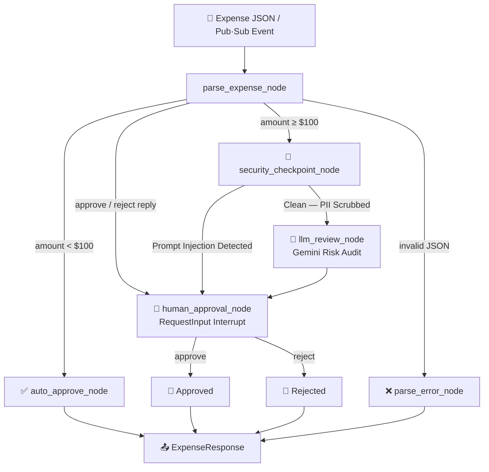
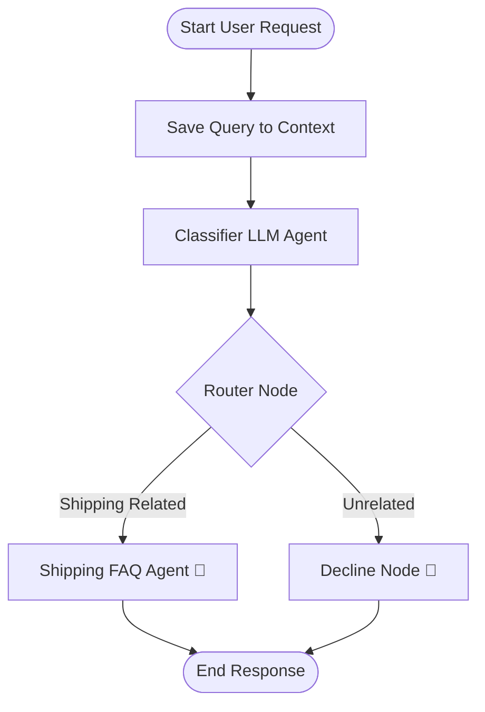
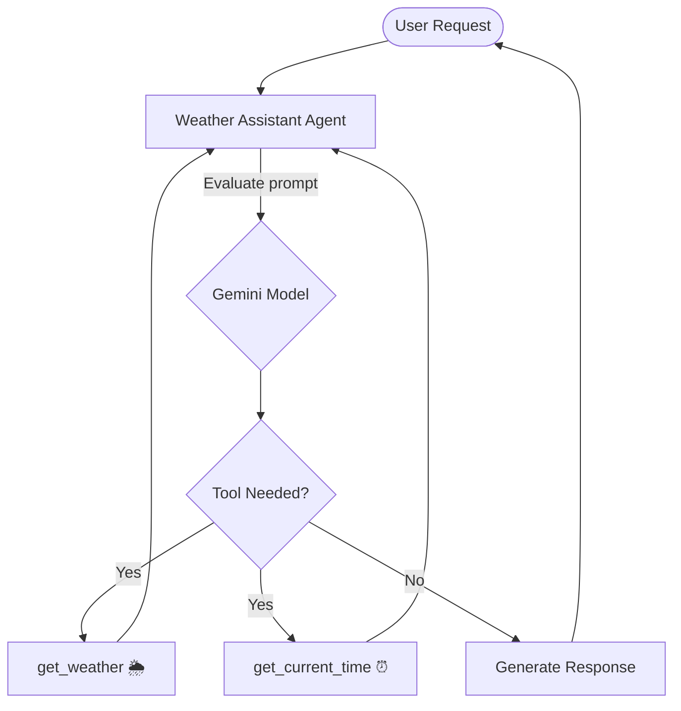

# 5-Day AI Agents Intensive Vibe Coding Course with Google 🚀

> A hands-on, project-based course exploring the full spectrum of AI Agent development — from simple CLI tools to ambient, event-driven multi-agent systems — using **Google's Agent Development Kit (ADK)**, **Gemini models**, and **Google Cloud Platform**.

---

## 📂 Course Navigation

| Day | Topic | Project | Status |
|-----|-------|---------|--------|
| **Day 1** | Node.js CLI & News APIs | [Google News CLI](#-day-1-google-news-cli) | ✅ Complete |
| **Day 2** | Google AI Studio | [`Google_AI_studio/`](./Google_AI_studio/) | ✅ Complete |
| **Day 3** | ADK Routing Workflows & Tool Calling | [`Day3/`](./Day3/README.md) | ✅ Complete |
| **Day 4** | Ambient Agents & Human-in-the-Loop | [`Day4/`](./Day4/ambient-expense-agent/README.md) | ✅ Complete |
| **Day 5** | Multi-Agent Systems | _Coming soon_ | 🔜 |

---

## 🏗️ Day 4: Ambient Expense Agent

### Overview
An **event-driven, ambient AI agent** that processes corporate expense submissions through a multi-stage security and approval pipeline — featuring **Human-in-the-Loop (HITL)** workflows, **PII redaction**, **prompt injection detection**, and structured **Gemini LLM** risk auditing.

### Architecture Diagram



### Key Features
- 🔐 **Multi-Layer Security** — PII scrubbing + prompt injection detection before any LLM call
- 🤖 **LLM Risk Auditing** — Gemini analyzes policy violations, suspicious patterns, vague descriptions
- 👤 **Human-in-the-Loop** — ADK `RequestInput` suspends/resumes workflow awaiting human decision
- 📦 **Structured Outputs** — Pydantic-enforced `ExpenseResponse` schema
- 🌐 **FastAPI + ADK Dev UI** — Full web interface for testing and interaction
- 🐳 **Docker + Cloud Run Ready** — Production deployment on GCP

📂 **[View Day 4 →](./Day4/ambient-expense-agent/README.md)**  
📐 **[Architecture Docs →](./Day4/ambient-expense-agent/ARCHITECTURE.md)**

---

## 🏗️ Day 3: AI Agents — Routing Workflows & Tool Calling

### 1. Customer Support Routing Agent

A multi-stage workflow that classifies user queries and routes them to specialized handlers.



### 2. Weather Assistant — Tool Calling

Demonstrates **function calling** where the agent decides which Python tool to invoke at runtime.



📂 **[View Day 3 →](./Day3/README.md)**  
📐 **[Architecture Docs →](./Day3/ARCHITECTURE.md)**

---

## 📰 Day 1: Google News CLI

A **premium interactive terminal app** built with Node.js for reading, searching, and browsing the latest news from Google News RSS feeds — directly in your command line.

### Features

| Feature | Description |
|---------|-------------|
| 🔥 **Top Stories** | Trending headlines from around the world |
| 📂 **Topic Categories** | Technology, Business, Science, Health, Sports, Entertainment |
| 🔍 **Keyword Search** | Find articles by topic or phrase |
| 🌍 **Region & Language** | US, UK, India, Germany, Japan, and more |
| 🔢 **Custom Limits** | Control articles displayed (5–50) |
| 🌐 **Browser Integration** | Open full articles directly in your browser |

### Quick Start

```bash
# Install dependencies
npm install

# Run interactively
npm start

# Direct search
npm start -- "artificial intelligence"
```

### Dependencies

- `@inquirer/prompts` — Interactive CLI prompts
- `rss-parser` — XML RSS parsing
- `chalk` — Terminal colors
- `boxen` — Elegant border boxes
- `open` — Open URLs in browser
- `ora` — Terminal spinner animations

---

## 🛠️ Repository Structure

```
5-Day-AI-Agents-Intensive/
├── Day3/                          # Day 3: Routing Workflows & Tool Calling
│   ├── customer-support-agent/    # Multi-stage routing agent
│   ├── weather-assistant/         # Tool calling demo
│   └── README.md
│
├── Day4/                          # Day 4: Ambient Agent + HITL
│   └── ambient-expense-agent/     # ⭐ Main Day 4 project
│       ├── expense_agent/         # ADK 2.0 workflow + nodes
│       ├── tests/                 # Unit, integration, eval tests
│       ├── README.md
│       └── ARCHITECTURE.md
│
├── Google_AI_studio/              # Day 2: AI Studio explorations
│
├── bin/                           # Day 1: Google News CLI binary
├── lib/                           # Day 1: CLI library modules
├── package.json                   # Day 1: Node.js dependencies
├── demo.py                        # General demo script
└── README.md                      # This file
```

---

## 🚀 Tech Stack Across the Course

| Technology | Used In |
|-----------|---------|
| **Node.js** | Day 1 — CLI tool |
| **Python 3.11** | Day 3, Day 4 |
| **Google ADK 2.0** | Day 3, Day 4 — Workflow orchestration |
| **Gemini API (AI Studio)** | Day 3, Day 4 — LLM capabilities |
| **Pydantic** | Day 3, Day 4 — Structured outputs |
| **FastAPI + uvicorn** | Day 4 — API server |
| **OpenTelemetry** | Day 4 — Observability |
| **Docker** | Day 4 — Containerization |
| **Google Cloud Run** | Day 4 — Serverless deployment |
| **uv** | Day 3, Day 4 — Python package management |

---

## 📖 Resources

- [Google Agent Development Kit (ADK)](https://adk.dev/)
- [Gemini API Documentation](https://ai.google.dev/docs)
- [Google AI Studio](https://aistudio.google.com/)
- [Google Cloud Run](https://cloud.google.com/run)

---

*This repository is part of the 5-Day AI Agents Intensive Vibe Coding Course with Google.*
