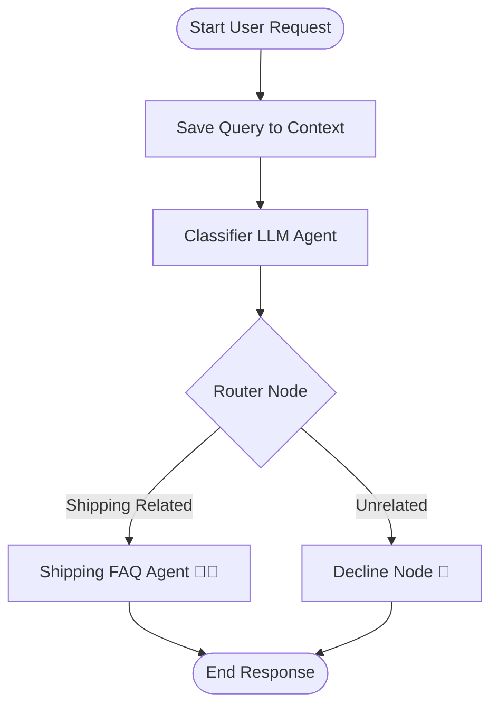
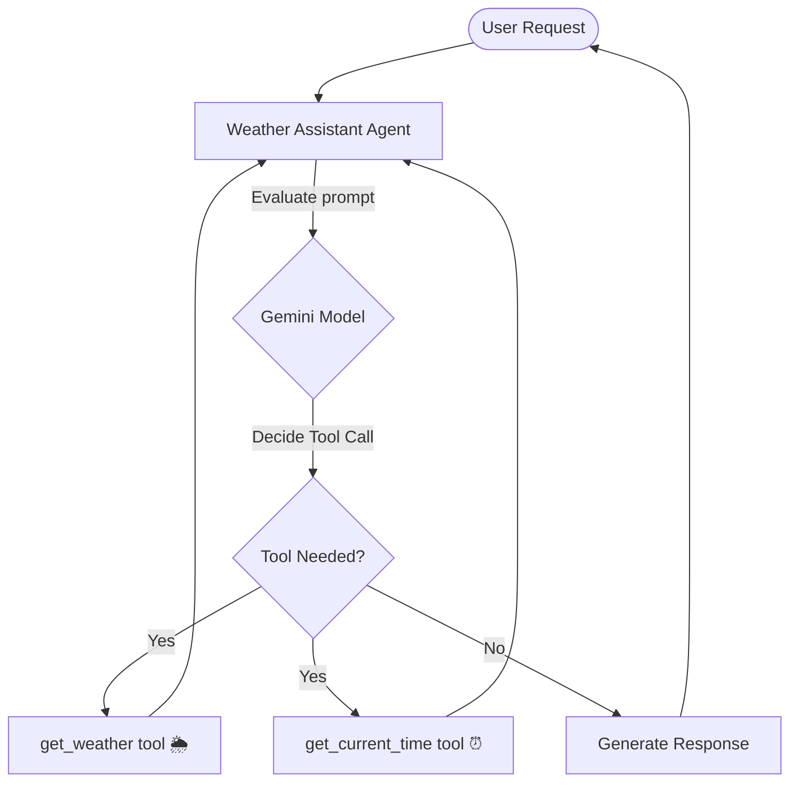

# 5-Day AI Agents Intensive Vibe Coding Course with Google 🚀

Welcome to the course repository! This branch (`Day3`) contains the code and architecture for Day 3.

## 📂 Navigation
- [Day 1: Google News CLI](#google-news-cli-) (in the root directory)
- [Day 3: AI Agents - Routing Workflows & Tool Calling](Day3/README.md) (in the `Day3/` directory)

---

## 🏗️ Day 3 Project Architecture & Workflows

### 1. Customer Support Routing Agent
This agent uses a multi-stage **Workflow** diagram. When a request comes in:
1. **Save Query**: Persists the user's query into the workflow context.
2. **Classifier Agent**: An LLM agent (`gemini-3.1-flash-lite`) determines whether the request is shipping-related or unrelated, outputting a structured Pydantic schema.
3. **Router Node**: Evaluates the classification and dynamically routes the request to either the FAQ responder or the decline message.



### 2. Weather Assistant (Tool Calling)
This assistant demonstrates **Function Calling (Tool Use)**. Rather than relying solely on pre-trained weights, the agent evaluates the query, decides if it requires external data, and triggers the appropriate Python function:
- `get_weather(query)`: Simulates looking up current temperatures.
- `get_current_time(query)`: Resolves real-time timezones using standard Python modules.



---

# Google News CLI 📰

A lightweight, premium, interactive terminal application built in Node.js to read, search, and view the latest news from Google News RSS feeds directly in your command line.

---

## Features
- 🔥 **Top Stories**: Instantly view the trending headlines from around the world.
- 📂 **Topic Categories**: Browse news curated by major categories:
  - Technology, Business, Science, Health, Sports, Entertainment, World, and Nation.
- 🔍 **Search Query**: Find specific news articles using keywords or phrases.
- 🌍 **Region / Language Preferences**: Choose from multiple locales (such as US, UK, India, Germany, Japan, etc.) to fetch news in your language and country.
- 🔢 **Custom Limits**: Control the number of articles displayed (5 to 50).
- 🌐 **Browser Integration**: Jump straight from the terminal to the full article on the web.
- ⚡ **Direct Search Mode**: Bypass the menu and search instantly from the command line (e.g. `npm start -- "artificial intelligence"`).

---

## Prerequisites
- [Node.js](https://nodejs.org/) (v18.0.0 or higher recommended)

---

## Installation & Setup

1. **Clone or navigate to the directory**:
   ```bash
   cd "a:\5-day online course\my-first-project"
   ```

2. **Install dependencies**:
   ```bash
   npm install
   ```

---

## How to Run

### 1. Interactive CLI Mode
Run the tool interactively to navigate menus, select articles, view details, and change settings:
```bash
npm start
```
*Alternatively, if running the CLI file directly:*
```bash
node bin/cli.js
```

### 2. Direct Search Mode
Search for specific news topics immediately:
```bash
npm start -- "artificial intelligence"
# or
node bin/cli.js "artificial intelligence"
```

### 3. Display Options & Help
Get details on command-line arguments and version:
```bash
node bin/cli.js --help
node bin/cli.js --version
```

---

## Configuration Settings
Preferences are stored in a local `.google-news-cli.json` file inside the project directory, so your configuration persists between runs. You can modify these settings via the `⚙ Settings` menu inside the application.

---

## Dependencies
- `@inquirer/prompts` - Modular and fully accessible command line prompts.
- `rss-parser` - Simple, lightweight XML RSS parsing library.
- `chalk` - Terminal color styling.
- `boxen` - Draws elegant border boxes in the terminal.
- `open` - Seamlessly opens URLs in the default browser.
- `ora` - Graceful terminal spinner animations.
